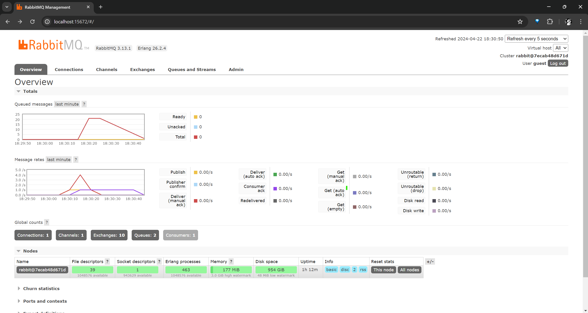

# Understanding subscriber and message broker.

a. what is ___amqp___?  
AMQP (Advanced Message Queuing Protocol) merupakan sebuah protokol jaringan untuk melakukan pengiriman dan penerimaan pesan antara sistem yang terpisah. Contohnya, pada kasus tutorial ini, yakni adanya subscriber dan publisher. AMQP memungkinkan program pada sistem yang berbeda untuk bertukar data. Selain itu, dengan menggunakan AMQP, sistem antar layanan dapat diimplementasikan dengan efisien. Penggunaan AMQP dapat memastikan bahwa pesan dikirim dengan baik, bahkan dalam kondisi jaringan yang tidak stabil. Selain itu, AMQP juga mendukung berbagai fitur lanjutan seperti mekanisme untuk mengatur antrian pesan.

b. what it means? `guest:guest@localhost:5672` , what is the first ___guest___, and what is 
the second ___guest___, and what is ___localhost:5672___ is for?  
`guest:guest@localhost:5672` merupakan bagian dari URL yang digunakan untuk menghubungkan dan mengatur koneksi ke server AMQP RabbitMQ. Guest pertama adalah username yang digunakan untuk autentikasi ke server AMQP RabbitMQ. Kemudian, guest kedua adalah password untuk username pada guest pertama untuk melakukan autentikasinya. Terakhir, untuk localhost:5672, localhost adalah hostname (alamat IP dari server AMQP) dan 5672 adalah port number dari RabbitMQ. Dengan menggunakan localhost, maka server AMQP berjalan di local pada port 5672 sebagai port default protokol AMQP. Jadi, `guest:guest@localhost:5672` berarti menghubungkan ke server AMQP di localhost pada port 5672 menggunakan username guest dan password guest.

# Simulation slow subscriber.

Berdasarkan screenshot tersebut, dapat terlihat bahwa jumlah queue atau queued message mencapai sekitar 20. Jumlah queue dapat mencapai angka tersebut karena adanya perubahan pada subscriber sehingga subscriber menerima message lebih lambat. Hal ini mengakibatkan penumpukan message karena kecepatan subscriber dalam menerima pesan tidak sebanding atau secepat dengan kecepatan publisher mengirim pesan. Ketidakseimbangan tersebut akan menyebabkan bertambahnya antrian message. Maka, ketika menjalan cargo run beberapa kali secara cepat pada publisher, maka subscriber akan memiliki beban yang berlebih karena banyaknya pesan yang diambil dan harus diproses sekaligus.